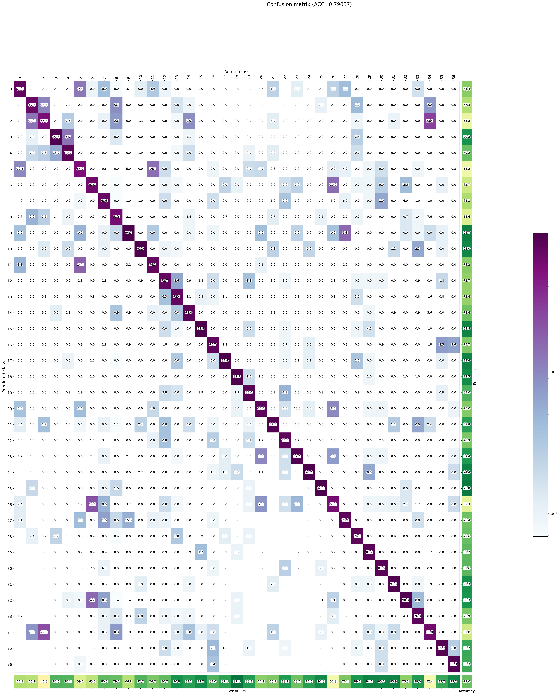
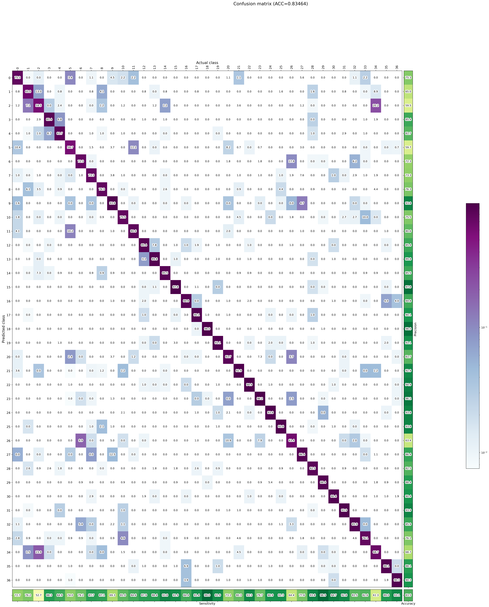
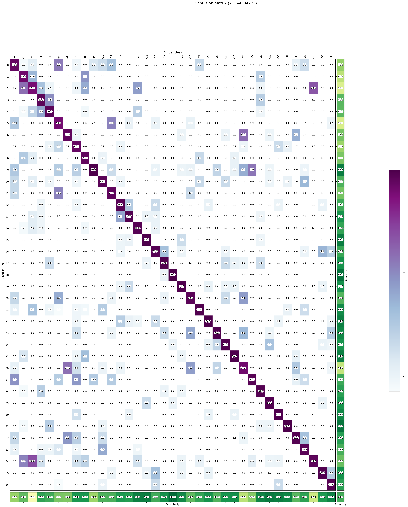
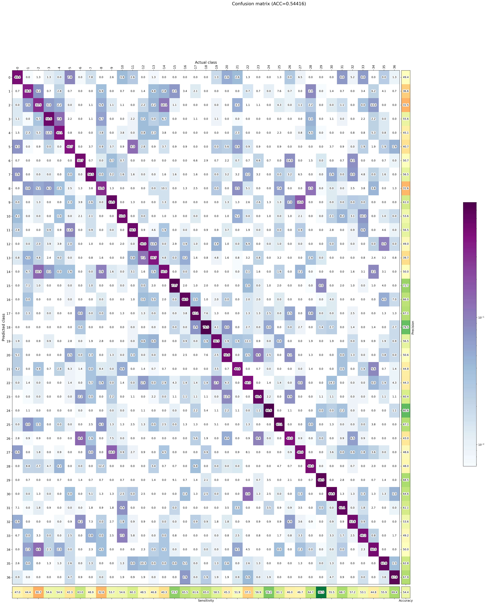
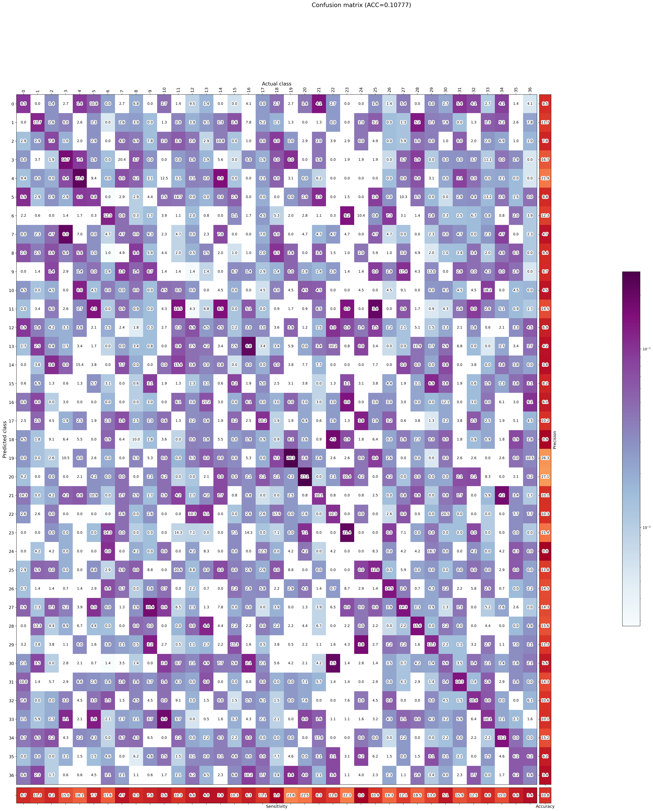

# l03 Pruning and Clustering
Mateusz Markiewicz - 298653

## Symetric vs asymetric quantization
$\begin{equation}
\begin{split}
WX_s & \sim S_W(W_{int}) S_X(X_{int})\\
&= S_WS_X(W_{int}X_{int}) \\
\\
WX_{as} & \sim S_W(W_{int}-Z_W) S_X(X_{int}-Z_X)\\
&= (S_W(W_{int})-S_W(Z_W))S_X(X_{int})-S_X(Z_X))\\
&= S_WS_X(W_{int}X_{int}) - S_WS_X(W_{int}Z_X) - S_WS_X(Z_WX_{int}) + S_WS_X(Z_WZ_X) \\
&= WX_s - S_WS_X(W_{int}Z_X) - S_WS_X(Z_WX_{int}) + S_WS_X(Z_WZ_X) \\
&= S_WS_X(W_{int}X_{int} - W_{int}Z_X - Z_WX_{int} + Z_WZ_X)
\end{split}
\end{equation}$

The $S_WS_X(Z_WZ_X)$ (or the $Z_WZ_X$) term can be precomputed, but the rest brings the overhead.

## Models performance

### Clustering, num_clusters=2

#### Metrics

* Accuracy: 0.7849550286181521
* Mean precision: 0.7837434370136956
* Mean sensitivity: 0.7903692352214424
* G-Mean: 0.7806325706866138
* Mean inference time: 15.287761804795936 ms
* Top-5 percentage: 1.0

#### Confusion matrix

### Clustering, num_clusters=4

#### Metrics

* Accuracy: 0.8301989642954484
* Mean precision: 0.8294092489147179
* Mean sensitivity: 0.8346390569892488
* G-Mean: 0.827422229692358
* Mean inference time: 15.124659808066594 ms
* Top-5 percentage: 1.0

#### Confusion matrix

### Clustering, num_clusters=8

#### Metrics

* Accuracy: 0.8411011174707005
* Mean precision: 0.8400620036148159
* Mean sensitivity: 0.8449405727083684
* G-Mean: 0.837534462568642
* Mean inference time: 14.48572366848182 ms
* Top-5 percentage: 1.0

#### Confusion matrix

### Clustering, num_clusters=16

#### Metrics

* Accuracy: 0.8381030253475061
* Mean precision: 0.8371814954774861
* Mean sensitivity: 0.8427292250162739
* G-Mean: 0.8359488565827673
* Mean inference time: 15.167428739915977 ms
* Top-5 percentage: 1.0

#### Confusion matrix

### Clustering, num_clusters=32

#### Metrics

* Accuracy: 0.8397383483237939
* Mean precision: 0.8386981653649425
* Mean sensitivity: 0.8433239085450218
* G-Mean: 0.8361860250015153
* Mean inference time: 15.018484778349748 ms
* Top-5 percentage: 1.0

#### Confusion matrix

### Pruning, sparsity=0.2

#### Metrics

* Accuracy: 0.8364677023712184
* Mean precision: 0.8355992742243178
* Mean sensitivity: 0.8389950272490623
* G-Mean: 0.8326602047828923
* Mean inference time: 15.010443221915567 ms
* Top-5 percentage: 1.0

#### Confusion matrix

### Pruning, sparsity=0.4

#### Metrics

* Accuracy: 0.5374761515399291
* Mean precision: 0.5360831005113741
* Mean sensitivity: 0.5441604716320317
* G-Mean: 0.5310179316981233
* Mean inference time: 14.96566781242743 ms
* Top-5 percentage: 1.0

#### Confusion matrix

### Pruning, sparsity=0.5

#### Metrics

* Accuracy: 0.09866448623603162
* Mean precision: 0.0984025282253013
* Mean sensitivity: 0.1077732638696401
* G-Mean: 0.0
* Mean inference time: 15.447141440560973 ms
* Top-5 percentage: 1.0

#### Confusion matrix

## Models compression

### Clustering, num_clusters=2

* deflated 48%
* size 8 452

### Clustering, num_clusters=4

* deflated 46%
* size 8 616

### Clustering, num_clusters=8

* deflated 44%
* size 8 972

### Clustering, num_clusters=16

* deflated 42%
* size 9 320

### Clustering, num_clusters=32

* deflated 40%
* size 9 588

### Pruning, sparsity=0.2

* deflated 20%
* size 12 904

### Pruning, sparsity=0.4

* deflated 35%
* size 10 484

### Pruning, sparsity=0.5

* deflated 43%
* size 9 164

## Questions

### In their best variants, how do quantization, pruning and clustering compare to each other (both performance- and quality-wise)?

The best version of pruned model is a bit worse than best version of clustered model. We need to keep in mind that using too sparse model can dramaticly decreas eour accuracy (eq. sparsity=0.4 vs sparsity=0.5).

Clustering gets a bit worse results than FP32 but outperforms int quantized models. Clustering was also faster than int quantization, but I tested it on different computers.

### How do the sizes of compressed models compare to the size of the TFLite FP32 model (how many times is each of the models smaller than the uncompressed FP32 solution).

The FP32 model weights 15.7MB, the smallest clustered model was 48% smaller and the smallest pruned model was 43% smaller. Int 8 model was nearly 4 times smaller than FT32.

### What does deflation means in ZIP tool and how does it correspond to the observed model optimizations?

Deflations reflect model compression in terms of size. With 50% deflation, we can estimate that this model will be 2 times smaller than FP32.

### Which of the compression methods gives the smallest and best-performing model (is there a dominating solution on both factors)?

Int models were the smallest, but Clustering outperforms them in terms of accuracy.